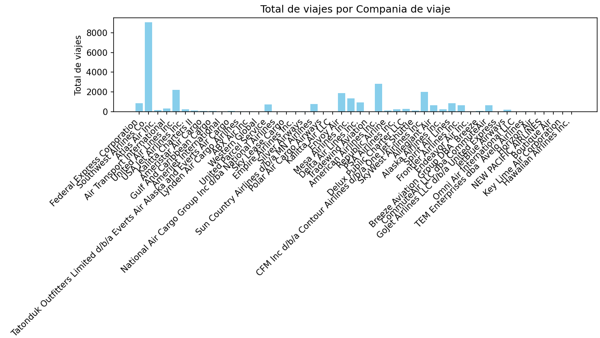
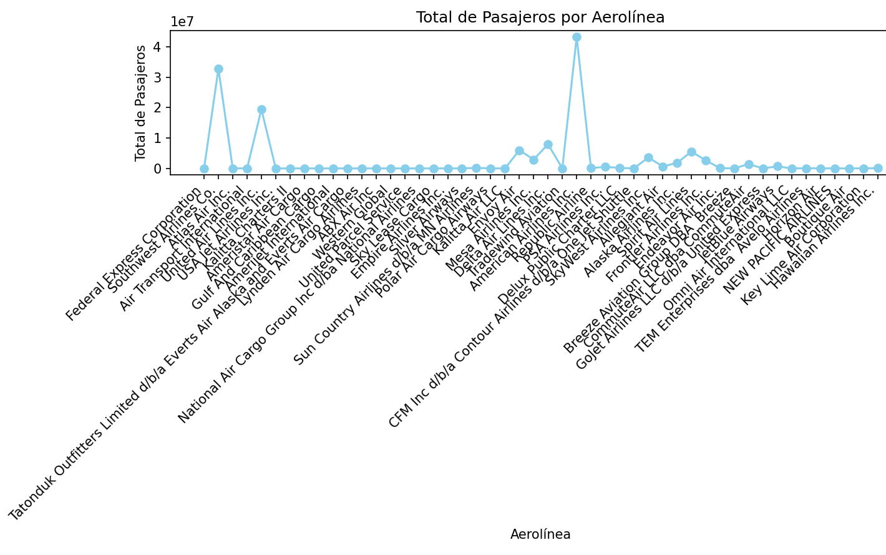
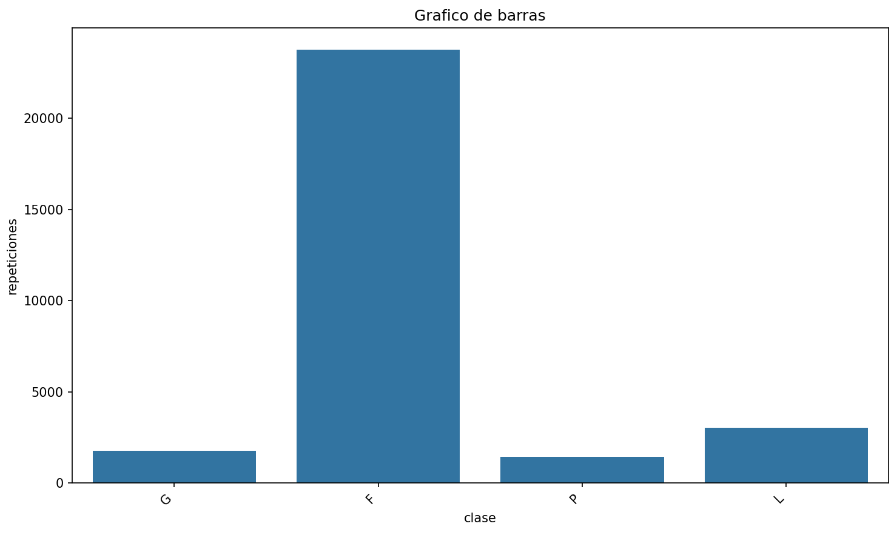

# ie0217
## Este es el archivo README de Aurelio Cordoba Valerio, C12326

**En este archivo se presentan las instrucciones necesarias para la ejecusión de la tarea número 5 y el analisis de los datos de los graficos, posteriormente se presentan las preguntas y respuestas solicitadas en las sección de teoría.**

**Sección de como funciona**
Para correr el programa, se requiere usar el archivo Makefile, en este caso como se trata de python, el makefile no es tan extenso y su facilidad de manejar es considerable. Para empezar, no estan presentes los comandos de limpiar ni de compilar por la naturaleza del lenguaje. Entonces, en este caso para que se ejecute el programa en su totalidad solamente es necesario el comando de run, que ejecuta el archivo en donde esta el resto del codigo, en este caso es la interfaz grafica, por lo tanto con tan solo el comando mingw32-make es suficiente para correr el codigo, sin embargo la alternativa de mingw32-make run tambien es valida.  

**Sección de análisis**  
Ahora bien, en lo que respecta al analsis de los datos proporcionados, en este caso se selecciono una serie de datos de viajes nacionales aereos en la zona de texas de estados unidos, los vuelos son tanto nacionales como locales. Se toman en cuenta la cantidad de pasajeros, el peso del equipaje que llevan, la clase en la que viajan, el mes en el que viajan, el lugar de destino, el lugar de origen, la distancia y la aerolinea. Para efecto de nuestro analisis, del archivo original se eliminan ciertos datos del archivo original "datos.csv", cosas como la identificacion de la aerolinea, y las identificaciones de origen y de salida estan entre las cosas que se eliminan. Esto ya que no proporcionan informacion importante de manera inmediata para el desarrollo de la tarea.Adicionalmente tambien se eliminan bastantes lineas sin pasajeros ni cargamento, puesto que son vuelos de reconocimiento.  
Ahora bien, para iniciar respecto a analisis de resultados, segun lo que se imprime en la terminal, es posible ver que el promedio de distancia recorrida en millas atravez de este es de casi 940, considerando que el area de texas es de 268 596 millas cuadradas, es adecuado decir que se cubre un espacio considerable de terreno. Tambien es posible ver que el aeropuerto con mas vuelos de origen y de llegada se trata de el DFW, que es el aeropuerto de Dallas-Fort Worth, esto tiene sentido, ya que este es el aeropuerto mas transitado del estado y el tercero mas transitado a nivel de estados unidos. Adicionalmente se puede ver que en el mes que mas se desplaza o se mueve el sistema aereo se trata de setiembre.  
Pasando propiamente al analisis de los graficos, para empezar se tiene el siguiente grafico:  
  
En este caso, se puede ver que sin lugar a duda la aerolinea que hace mas viajes se trata de Southwest airlines, y en segundo lugar se encuentra american airlines, esto tiene sentido, con un poco de investigacion se puede ver que southwest airlines es una de las aerolineas de bajo costo mas importantes a nivel de Estados Unidos y posiblemente la mas grande a nivel mundial. Casualmente tiene su sede en Dalas, Texas. Por lo tanto no es raro que sea la empresa que mas opera bajo este modo ni nivel, es importante mencionar que esta aerolinea maneja tanto la opcion de vuelos comerciales como vuelos solo de carga. El segundo lugar se lo lleva american airlines, el cual es un respetable puesto. American Airlines se trata de una empresa multinacional que opera en Fort Worth texas, tienen extensas redes nacionales e internacionales, ellos se especializan en el cargo de pasajeros, por lo tanto no es raro que hagan menos vuelos, pero lleven mas pasajeros, este dato se va a confirmar en la siguiente grafica. Es importante ver que realmente casi ninguna de las aerolineas se le puede comparar al volumen de viajes de estos dos titanes.  
Seguidamente se presenta el grafico de la cantidad de pasajeros en funcion a la aerolinea:
  
En este caso es posible apreciar que se cambian los papeles, es American Airlines el puntero en lo que respecta a transporte de pasajeros, con mas de 40 milliones de pasajeros, siendo esta una cifra realmente impresionante, casi 10 milliones de pasajeros mas abajo se encuentra Southwest Airlines. Finalmente en tercer lugar se tiene a United Air Lines, empresa que con casi 20 milliones de pasajeros se encuentra en el top. Es posible ver que, como American Airlines se especiliza en el cargo de pasajeros, solamente es natural que esta empresa lleve la delantera.
Ahora se tiene otro grafico, el grafico de la clase de viaje, en este caso es importante mencionar que la letra G se trata de el transporte de solamente cargamento, F se trata de un transporte de cargamento o pasageros de tipo F o baja clase, P se trata de un vuelo de cargamento civil, y finalmente la L se trata de un cargamento de vuelo civil y de cargamento tipo civil, acontinuacion se presenta el grafico:
 
Ahora bien, es posible apreciar que, con diferencia, la clase de vuelo que mas se repite se trata de la clase F, eso quiere decir que los vuelos que mas se dan son los de pasageros y cargamento de clase baja, le siguien los vuelos de tipo L, que son los de cargamento y pasageros de tipo civil, luego le siguen los tipo G y P respectivamente. Como se puede apreciar, los vuelos que dominan son los vuelos de clase baja o accesibles, esto no es raro, puesto que la empresa con mas vuelos en la zona se trata de Southwest Airlines.  
### Seguidamente se pasa a la parte de preguntas y respuestas 
**1. ¿Que es un iterador en Python y cuál es su propósito?**  
En python, un iterador se trata de un objeto que tiene la capacidad de recorrer un contenedor de elementos, como una lista, un diccionario o una tupla, uno a la vez. Su propósito principal es proporcionar un mecanismo eficiente para acceder secuencialmente a los elementos de una colección sin la necesidad de conocer la estructura subyacente de dicha colección. Generalmente son utilizados para recorrer secuencialmente elementos de estructuras de datos, facilitando la manipulación de grandes conjuntos de datos.  
**2. Explica la diferencia entre un iterable y un iterador**  
Para empezar, un iterable se trata de cualquier objeto que sea se puede recorrer mediante un bucle, como una lista, una tupla, un diccionario o un conjunto. Un iterable es una entidad que puede proporcionar un iterador cuando se le solicita. Los iterables son objetos sobre los cuales se puede iterar.  
Luego está el iterador, un iterador es una entidad que se utiliza para recorrer un iterable, manteniendo un estado interno que registra la posición actual en la iteración y permite obtener el siguiente elemento. Es un objeto que implementa el protocolo de iteración, lo que significa que tiene métodos como __iter__() y __next__() que permiten acceder secuencialmente a los elementos del iterable.  
**3. Define que es una excepción en Python**  
La excepción se trata de una situación que pasa dentro de la ejecución de un programa, deteniendo u obstaculizando el flujo normal del mismo por un comportamiento no esperado. Estas pueden ser creadas de manera personalizada por el programador o generadas de forma automática por el compilador.  
**4. ¿Cual es el propósito de la cláusula try...except en el manejo de excepciones?**  
Estas se usan para controlar o regular las excepciones que ocurren dentro del código de python. El ´try´ permite definir un bloque de código en el cual pueden ocurrir excepciones, mientras que la cláusula ´except´ proporciona una forma de manejar estas excepciones de manera controlada, evitando que el programa se bloquee o se detenga abruptamente. En lugar de dejar que el programa falle debido a una excepción no controlada, el bloque ´except´ permite tomar acciones específicas, como mostrar un mensaje de error o registrar la excepción.  
Obtenido de : https://www.freecodecamp.org/espanol/news/sentencias-try-y-except-de-python-como-menejar-excepciones-en-python/  
**5. Explica la diferencia entre las cláusulas except y finally en el manejo de excepciones.**  
Inicialmente, la cláusula ´except´ es usada para manejar excepciones específicas, que ocurren dentro de un bloque de ´try´. En este tipo de cláusula es posible definir varios bloques para manejar distintos tipos de excepciones de manera individual.  
Seguidamente está la cláusula finally, la cual es la encargada de definir un bloque de código que se ejecutará siempre, independientemente de si se produjo una excepción o no dentro del bloque ´try´. Esto es útil para realizar limpieza de recursos o tareas que deben ejecutarse sin importar si se produjo una excepción durante la ejecución del código en el bloque ´try´. Es un mensaje que se muestra de una u otra forma, de manera segura.  
obtenido de: https://www.freecodecamp.org/espanol/news/sentencias-try-y-except-de-python-como-menejar-excepciones-en-python/  
**6. ¿Que es un generador en Python y cual es su ventaja sobre las listas tradicionales?**  
Se trata de una función que produce una secuencia de valores sobre la marcha, en lugar de generar y almacenar todos los valores en la memoria al mismo tiempo como lo haría una lista tradicional. Su ventaja principal en comparación a las listas tradicionales, radica en su eficiencia en cuanto al uso de la memoria y la velocidad de ejecución. Los generadores permiten generar valores de manera perezosa o lazy, lo que quiere decir que solo se calculan y devuelven los valores cuando son necesarios, evitando así el consumo innecesario de memoria y recursos.  
obtenido de: https://www.gyata.ai/es/python/python-generator/  
**7. Explica cómo se puede crear un generador usando la función yield.**  
Estos se pueden crear utilizando la palabra clave ´yield´ dentro de su función. Cuando una función contiene la palabra clave yield, se convierte en un generador, la función puede generar un valor utilizando yield, deteniendo su ejecución temporalmente y devolviendo el valor al llamador. La función puede ser reanudada desde el último punto de suspensión cuando se llama nuevamente. Para que quede más claro se proporciona el ejemplo con un código.
```
def my_generator(n):
    # initialize counter
    value = 0
    # loop until counter is less than n
    while value < n:
        # produce the current value of the counter
        yield value
        # increment the counter
        value += 1

# Iterar sobre el generador producido por my_generator
for value in my_generator(3):
    # Imprimir cada valor producido por el generador
    print(value)

```
**8. ¿Cuándo es más apropiado usar generadores en lugar de listas?**  
Existen diversos casos en los cuales usar generadores prueba ser más efectivo que el uso de listas tradicionales, los siguientes pueden ser considerados ejemplos de lo mismo: Para empezar, cuando se trabaja con grandes conjuntos de datos que no calzan en la memoria disponible, cuando se deben de generar valores de forma perezosa y eficiente, cuando se quiere evitar la sobrecarga de la memoria asociada a la creación de listas, y si se desea iterar una secuencia de valores de forma incremental en lugar de todos de una vez.  
Obtenido de: https://www.gyata.ai/es/python/python-generator/  
**9. ¿Cual es la diferencia entre una Serie y un DataFrame en Pandas?**  
Se tiene que una serie es una estructura unidimensional de datos etiquetados, es posible que esta contenga cualquier tipo de datos (enteros, cadenas, flotantes … ). En otras palabras, una serie es como una columna de una tabla.  
En cambio un DataFrame se trata de una estructura de datos bidimensional, etiquetada en columnas que pueden contener distintos tipos de datos. Este tipo de estructura se puede ver como una tabla de excel, cada columna de un DataFrame puede ser una serie.  
**10. Explica cómo manejar valores nulos o faltantes en un DataFrame**
Existen varias maneras de manejar un valor nulo en panda, la mayoría de ellas involucran el uso de métodos, por ejemplo el uso de ´isna()´ o ´notna()´ es para detectar valores nulos o no nulos respectivamente. Luego está ´fillna()´ que se encarga de rellenar los valores nulos con un valor en particular y finalmente se tiene ´dropna()´, el cual cumple con la función de eliminar las filas o columnas compuestas por valores nulos. Todos estós métodos son utilizados antes de realizar el modelado.  
Obtenido de: https://docs.kanaries.net/es/topics/Pandas/pandas-missing-value  
**11.¿Cual es la diferencia entre loc y iloc en Pandas?**  
Para empezar, ́loc ́ da la capacidad de accesar a una serie de filas y columnas mediante etiquetas o matrices, accede a los elementos mediante etiquetas de fila y columna. ´iloc´ permite acceder a un grupo de filas y columnas por posición de índice entero. En otras palabras, se utiliza para acceder a elementos utilizando índices enteros de fila y columna.  


